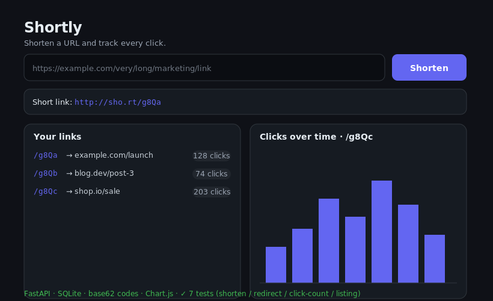

# Shortly — url-shortener

[](https://github.com/JCreatesGH/url-shortener/actions)
[](https://www.python.org/)
[](LICENSE)

A full-stack URL shortener with a click-analytics dashboard. **FastAPI + SQLite** backend with base62 short codes and per-click tracking; a self-contained frontend that lists your links and charts clicks over time.



## Run it

```bash
pip install -r requirements.txt
uvicorn app.main:app --reload      # http://localhost:8000
# or
docker build -t shortly . && docker run -p 8000:8000 shortly
```

Open `http://localhost:8000`, paste a URL, and watch the dashboard update as the short link gets clicked.

## API

| Method | Route | Purpose |
|--------|-------|---------|
| `POST` | `/api/shorten` | `{ "url": "https://..." }` → `{ code, short_url, target }` |
| `GET`  | `/{code}` | 302-redirect to the target and record a click |
| `GET`  | `/api/stats/{code}` | total clicks + clicks grouped by day |
| `GET`  | `/api/links` | all links with click counts |

## How it works

- **Short codes** are base62-encoded row IDs (`app/shortcode.py`) — compact, URL-safe, and collision-free. Round-trip tested.
- **Analytics** — every redirect inserts a row in `clicks` with a timestamp and referrer; `/api/stats` aggregates by day for the chart.
- **Validation** — Pydantic rejects anything that isn't an http(s) URL (422).

## Development

```bash
python -m pytest -q   # 7 tests (codec + API: shorten, redirect, click counting, listing)
```

## License

MIT
